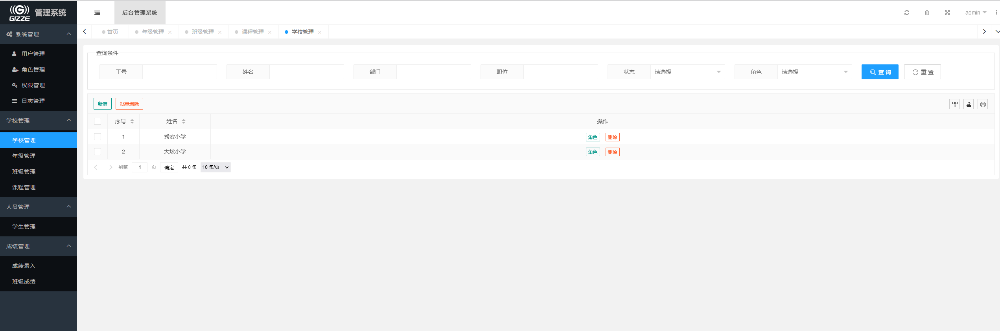
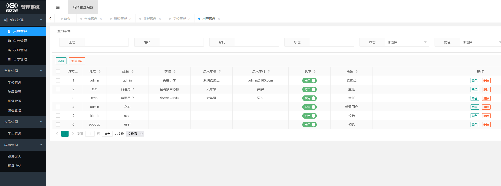
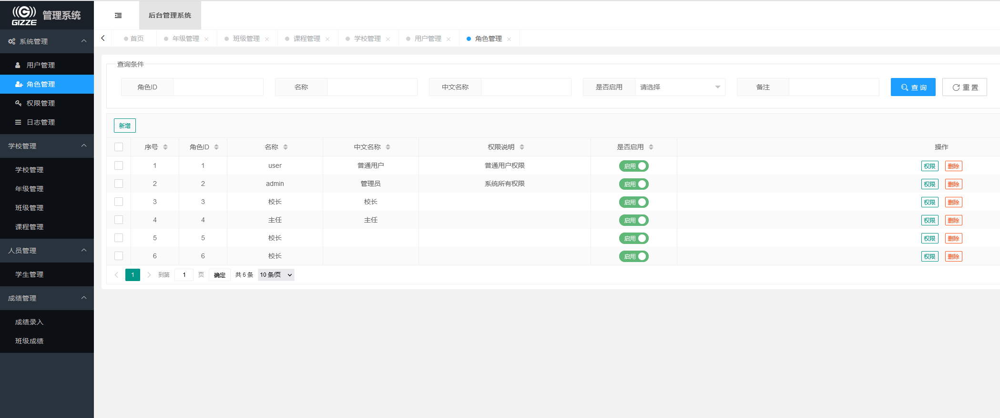
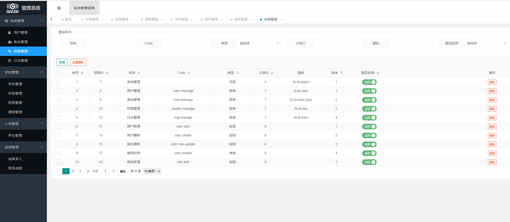
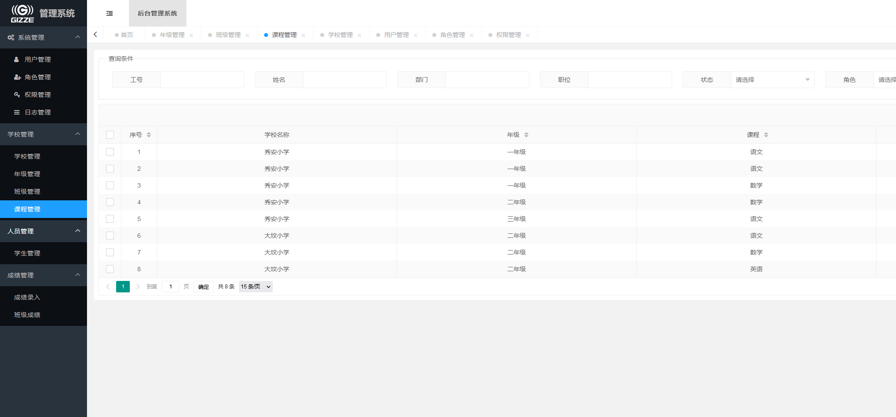

# Django学生成绩管理系统

#### 介绍

一个利用后端Django+前端layui,数据库用Mysql的学生成绩管理系统。

#### 软件架构

#### 安装教程

#### 使用说明

测试地址：http://124.223.77.133:8009

1. 成绩录入测试账号：test  密码：123
在线成绩录入，具体指定录入哪个年级、哪个科目由超级管理员指定。
2. 学校管理员账号：zhuren 密码:123
学校管理员拥有对年级、班级、学生名单、成绩统计等功能
3. 这里是列表文本超级管理员 账号：admin 密码：admin
超级管理员拥有创建账号、权限管理、创建学校等功能。

#### 特技

1.  使用 Readme\_XXX.md 来支持不同的语言，例如 Readme\_en.md, Readme\_zh.md
2.  Gitee 官方博客 [blog.gitee.com](https://blog.gitee.com)
3.  你可以 [https://gitee.com/explore](https://gitee.com/explore) 这个地址来了解 Gitee 上的优秀开源项目
4.  [GVP](https://gitee.com/gvp) 全称是 Gitee 最有价值开源项目，是综合评定出的优秀开源项目
5.  Gitee 官方提供的使用手册 [https://gitee.com/help](https://gitee.com/help)
6.  Gitee 封面人物是一档用来展示 Gitee 会员风采的栏目 [https://gitee.com/gitee-stars/](https://gitee.com/gitee-stars/)
